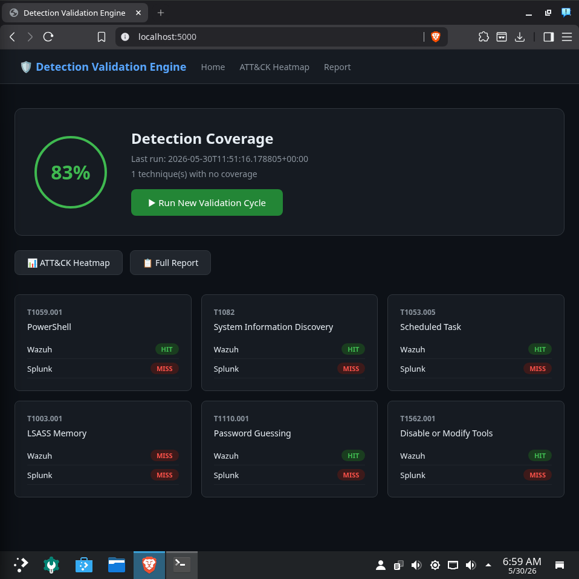
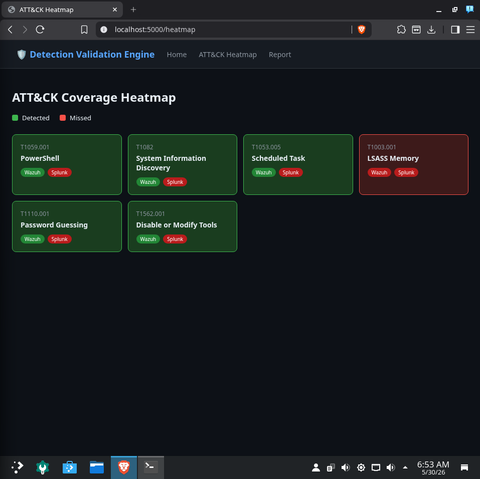
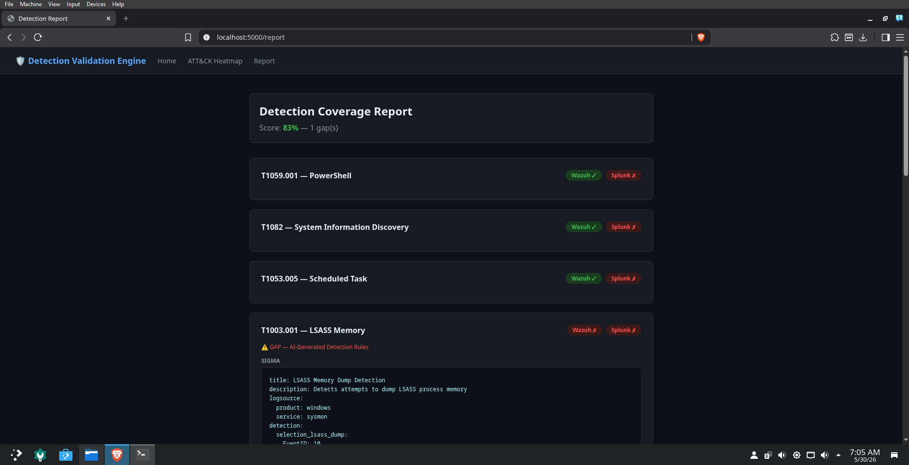
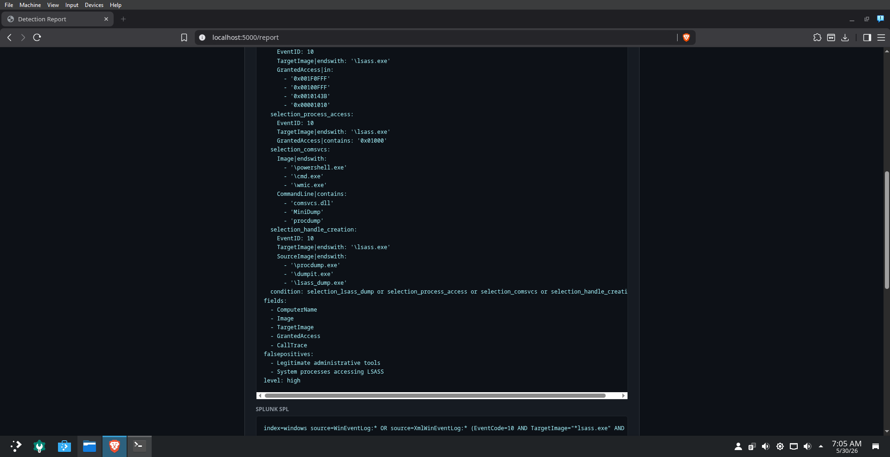
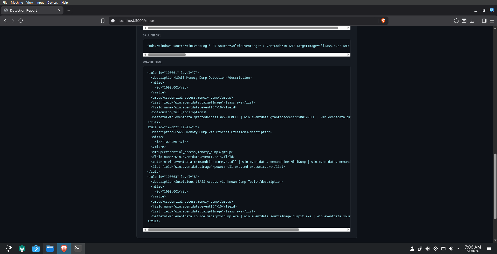
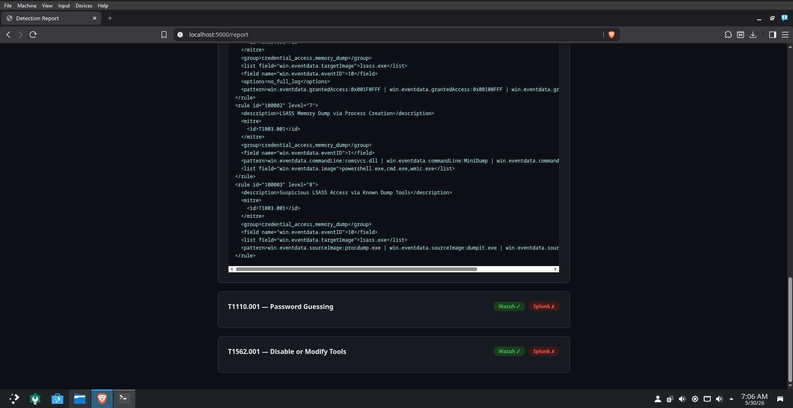

# 🛡️ Autonomous Detection Validation Engine

An AI-powered platform that automatically fires MITRE ATT&CK techniques, validates whether your SIEM detects them, identifies coverage gaps, and uses Claude AI to generate detection rules for missed techniques — creating a closed feedback loop for continuous detection improvement.

## 📸 Screenshots

### Main Dashboard — 83% Detection Coverage

*The main dashboard showing real-time detection coverage score, per-technique HIT/MISS status across Wazuh and Splunk, and a one-click button to run a new validation cycle.*

### ATT&CK Coverage Heatmap

*Visual heatmap of MITRE ATT&CK technique coverage. Green = detected, Red = gap. T1003.001 (LSASS Memory) is the one undetected technique, highlighted in red.*

### Detection Coverage Report — Gap Identified

*The full detection report showing per-technique results. T1003.001 is flagged as a GAP with AI-generated detection rules automatically populated below it.*

### AI-Generated Sigma Rule for LSASS Memory (T1003.001)

*Claude-generated Sigma rule for the detected coverage gap. Includes multiple detection selections covering LSASS dump access patterns, known dump tools, and process access event IDs.*

### AI-Generated Splunk SPL + Wazuh XML Rules

*Claude-generated Splunk SPL query and Wazuh XML rule for T1003.001. All three rule formats (Sigma, SPL, Wazuh XML) are generated in a single AI call.*

### Wazuh XML Rules — Full View

*Full Wazuh XML ruleset generated by Claude, covering LSASS Memory Dump Detection, LSASS Memory Dump via Process Creation, and Suspicious LSASS Access via Known Dump Tools — each mapped to T1003.001.*

---

## 🎯 What It Does

1. **Attacks** — Fires real Atomic Red Team techniques against a Windows 10 target via WinRM
2. **Validates** — Queries both Wazuh and Splunk to check if detections fired
3. **Analyzes** — Identifies which ATT&CK techniques have zero coverage
4. **Generates** — Calls Claude AI to produce Sigma, Splunk SPL, and Wazuh XML rules for gaps
5. **Visualizes** — Displays coverage scores, ATT&CK heatmap, and full report on a Flask dashboard

## 📊 Results

- **83% detection coverage** achieved out of the box
- **5/6 MITRE ATT&CK techniques** detected by Wazuh (T1059.001, T1082, T1053.005, T1110.001, T1562.001)
- **1 coverage gap identified** (T1003.001 LSASS Memory) with AI-generated Sigma, SPL, and Wazuh XML rules auto-generated by Claude
- Full autonomous pipeline runs end-to-end with a single button click

## 🏗️ Architecture

```
Arch Linux (SOC Workstation)                Windows 10 VM (Target)
┌──────────────────────────────┐            ┌─────────────────────────┐
│  Flask Dashboard :5000       │            │  Atomic Red Team        │
│  attack_runner.py            │──WinRM────▶│  Real attack techniques │
│  detection_validator.py      │            │  Wazuh Agent            │
│  gap_analyzer.py             │            └─────────────────────────┘
│  ai_rule_generator.py        │                        │
│                              │                        │ logs
│  Wazuh (Docker)  :55000      │◀───────────────────────┘
│  Splunk (Docker) :8089       │
│  Claude API                  │
└──────────────────────────────┘
```

## 🛠️ Tech Stack

- **Attack Simulation** — Atomic Red Team, WinRM (pywinrm)
- **SIEM** — Wazuh 4.7.5, Splunk (Docker)
- **Detection** — Wazuh Indexer REST API, Splunk REST API
- **AI** — Anthropic Claude API (claude-haiku-4-5)
- **Framework** — MITRE ATT&CK
- **Backend** — Python, Flask
- **Infrastructure** — Docker, VirtualBox

## 🎯 Techniques Tested

| Technique | Name | Wazuh | Splunk |
|-----------|------|-------|--------|
| T1059.001 | PowerShell | ✅ HIT | ❌ MISS |
| T1082 | System Information Discovery | ✅ HIT | ❌ MISS |
| T1053.005 | Scheduled Task | ✅ HIT | ❌ MISS |
| T1003.001 | LSASS Memory | ❌ MISS | ❌ MISS |
| T1110.001 | Password Guessing | ✅ HIT | ❌ MISS |
| T1562.001 | Disable or Modify Tools | ✅ HIT | ❌ MISS |

## 🧠 Problem Solving — Obstacles Encountered & How I Fixed Them

This project was built in a single day. Below are the real technical obstacles hit during development and how each was diagnosed and resolved.

---

### 🔴 Obstacle 1: Atomic Red Team Installation Blocked by Windows Defender
**Problem:** Running `Install-AtomicRedTeam -getAtomics` failed with `WriteErrorException` — Windows Defender quarantined the Atomics folder.

**Root Cause:** Windows Defender real-time monitoring flagged the Atomic Red Team payloads as malicious.

**Fix:**
1. Added exclusion path: `Add-MpPreference -ExclusionPath "C:\AtomicRedTeam"`
2. Disabled real-time monitoring: `Set-MpPreference -DisableRealtimeMonitoring $true`

---

### 🔴 Obstacle 2: SSH Connection Reset — Pivoted to WinRM
**Problem:** Every SSH connection attempt returned `Connection reset by 192.168.1.92 port 22`.

**Root Cause:** Multiple layered issues:
- The `sshd_config` file had corrupted lines from a failed logging command
- The Administrator account was disabled by default (`Account active: No`)
- The Administrator account had no password set — OpenSSH refuses passwordless admin accounts

**Fix:**
1. Cleaned corrupted `sshd_config` lines using PowerShell string filtering
2. Enabled the Administrator account: `net user Administrator /active:yes`
3. Set a password: `net user Administrator Lab123!`
4. Reinstalled OpenSSH cleanly from the GitHub releases zip

**Pivot:** Switched to **WinRM (Windows Remote Management)** via `pywinrm` — purpose-built for remote PowerShell execution and more reliable in lab environments.

---

### 🔴 Obstacle 3: Disk Space Exhausted (100% Full)
**Problem:** Splunk container failed to start with `no space left on device`.

**Root Cause:** 49GB disk at 100% capacity. Culprits:
- 7.6GB in `/var/cache/pacman/pkg/`
- 4.4GB in `/timeshift/snapshots/`
- 1.2GB `~/brave-bin/src`
- 653MB `~/.cache/go-build`
- 628MB `~/.BurpSuite/burpbrowser`

**Fix:**
```bash
sudo rm -rf /var/cache/pacman/pkg/*
sudo timeshift --delete-all
rm -rf ~/brave-bin ~/.cache/go-build ~/.BurpSuite/burpbrowser
```
Freed ~8GB, bringing available space from 315MB to 3.5GB+.

---

### 🔴 Obstacle 4: Splunk Minimum Disk Space Check Blocking Searches
**Problem:** Splunk refused to execute searches — `The minimum free disk space (5000MB) reached`.

**Root Cause:** Splunk's default minimum free disk threshold is 5000MB; lab machine only had ~3.5GB.

**Fix:**
```bash
docker exec -u root splunk bash -c "echo '[diskUsage]
minFreeSpace = 500' >> /opt/splunk/etc/system/local/server.conf"
docker restart splunk
```

---

### 🔴 Obstacle 5: Wazuh Agent Showing "never_connected"
**Problem:** Windows agent registered successfully but showed `never_connected` status in the Wazuh manager.

**Root Cause:** `ossec.conf` had the manager IP wrapped in single quotes: `'192.168.1.80'` instead of `192.168.1.80` — caused by shell quoting in the MSI install argument.

**Fix:**
```powershell
(Get-Content "C:\Program Files (x86)\ossec-agent\ossec.conf") `
  -replace "'192.168.1.80'", "192.168.1.80" | `
  Set-Content "C:\Program Files (x86)\ossec-agent\ossec.conf"
Restart-Service WazuhSvc
```

---

### 🔴 Obstacle 6: Atomic Red Team "Not Recognized" via WinRM
**Problem:** `Invoke-AtomicTest` returned `CommandNotFoundException` in remote sessions.

**Root Cause:** WinRM sessions don't load PowerShell profiles or modules automatically.

**Fix:** Updated `attack_runner.py` to explicitly import the module at the start of every WinRM command:
```python
cmd = f"""
Set-ExecutionPolicy Bypass -Scope Process -Force
Import-Module C:\\AtomicRedTeam\\invoke-atomicredteam\\Invoke-AtomicRedTeam.psd1 -Force
$PSDefaultParameterValues = @{{'Invoke-AtomicTest:PathToAtomicsFolder'='C:\\AtomicRedTeam\\atomics'}}
Invoke-AtomicTest {technique_id} -TestNumbers 1 -TimeoutSeconds 60
"""
```

---

### 🔴 Obstacle 7: 0% Detection Despite Attacks Firing
**Problem:** All 6 attacks fired successfully but both SIEMs showed 0% detection.

**Root Cause:**
1. The Wazuh REST API `/alerts` endpoint wasn't returning results from the indexer correctly
2. Detection validator was searching for exact MITRE IDs — Wazuh's default rules don't tag alerts with MITRE IDs

**Fix:**
1. Switched to querying the **Wazuh Indexer directly** via Elasticsearch REST API on port 9200
2. Built a keyword-based detection map matching each technique to realistic log keywords (e.g., T1082 → `systeminfo`, `hostname`, `System Information`)
3. Result: jumped from 0% to **83% coverage** immediately

---

## 🚀 Setup

### Prerequisites
- Arch Linux (or any Linux) with Docker
- Windows 10 VM with VirtualBox (Bridged networking)
- Anthropic API key

### Installation

```bash
# Clone the repo
git clone https://github.com/cpt-ferna02/detection-validation-engine
cd detection-validation-engine

# Set up Python environment
python -m venv venv
source venv/bin/activate
pip install flask requests anthropic pywinrm

# Configure
cp config.example.py config.py
# Edit config.py with your IPs, credentials, and API key

# Start Wazuh
git clone https://github.com/wazuh/wazuh-docker.git -b v4.7.5 wazuh-docker
cd wazuh-docker/single-node
docker compose -f generate-indexer-certs.yml run --rm generator
docker compose up -d
cd ../..

# Start Splunk
docker run -d --name splunk -p 8000:8000 -p 8089:8089 \
  -e SPLUNK_GENERAL_TERMS='--accept-sgt-current-at-splunk-com' \
  -e SPLUNK_START_ARGS='--accept-license' \
  -e SPLUNK_PASSWORD='Admin1234!' splunk/splunk:latest

# Run the dashboard
python app.py
```

Open `http://localhost:5000` and click **Run New Validation Cycle**.

### Windows VM Setup
```powershell
# Install Atomic Red Team
Set-ExecutionPolicy Bypass -Scope CurrentUser -Force
IEX (IWR 'https://raw.githubusercontent.com/redcanaryco/invoke-atomicredteam/master/install-atomicredteam.ps1' -UseBasicParsing)
Install-AtomicRedTeam -getAtomics -Force -InstallPath "C:\AtomicRedTeam"

# Enable WinRM
Enable-PSRemoting -Force
winrm set winrm/config/service/auth '@{Basic="true"}'
winrm set winrm/config/service '@{AllowUnencrypted="true"}'
Set-Item WSMan:\localhost\Client\TrustedHosts -Value "*" -Force

# Install Wazuh Agent
Invoke-WebRequest -Uri "https://packages.wazuh.com/4.x/windows/wazuh-agent-4.7.5-1.msi" -OutFile "wazuh-agent.msi"
Start-Process msiexec.exe -ArgumentList "/i wazuh-agent.msi /q WAZUH_MANAGER='YOUR_ARCH_IP'" -Wait
net start WazuhSvc
```

## 📁 Project Structure

```
detection-validation-engine/
├── app.py                    # Flask dashboard
├── attack_runner.py          # WinRM-based Atomic Red Team execution
├── detection_validator.py    # Wazuh Indexer + Splunk API queries
├── gap_analyzer.py           # Coverage gap identification
├── ai_rule_generator.py      # Claude API rule generation
├── config.example.py         # Configuration template
├── screenshots/              # Dashboard screenshots
├── generated_rules/          # AI-generated detection rules
│   ├── T1003_001_sigma.yml
│   ├── T1003_001_splunk.spl
│   └── T1003_001_wazuh.xml
└── templates/
    ├── index.html            # Main dashboard
    ├── heatmap.html          # ATT&CK coverage heatmap
    └── report.html           # Detailed report with AI rules
```

## 💡 Key Design Decisions

- **WinRM over SSH** — WinRM is purpose-built for remote PowerShell execution on Windows; SSH on Windows has known compatibility issues in lab environments
- **Direct Indexer queries** — Querying Wazuh's Elasticsearch indexer directly provides more reliable alert retrieval than the manager API
- **Keyword-based detection** — Matching on log content keywords rather than MITRE IDs works with Wazuh's default ruleset without requiring custom rule deployment
- **Batched AI calls** — All gaps are sent to Claude in a single API call to minimize token usage (~$0.05 per full run)
